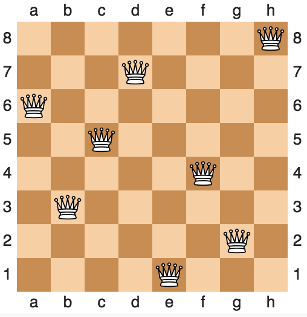

# Damenproblem

## appcom code contest Task 6

Wir haben ein 8x8 großes Schachbrett. Auf dieses setzen wir 8 Damen. Diese Damen können sich in 8 verschiedene Richtungen bewegen. Platziere alle Damen so auf dem Schachbrett, dass sie sich nicht besiegen können.

## Ausgabe

Stelle alle möglichen Schachbretter mit einem Frontend-Framework deiner Wahl dar und zeige die Anazhl aller möglichen Positionen an.
