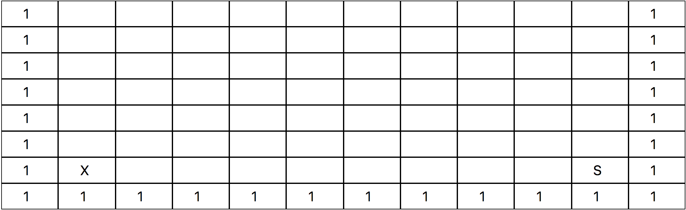
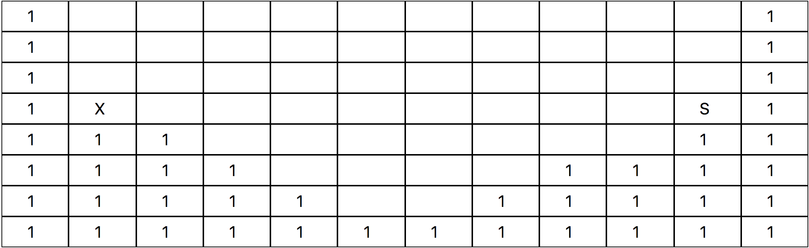
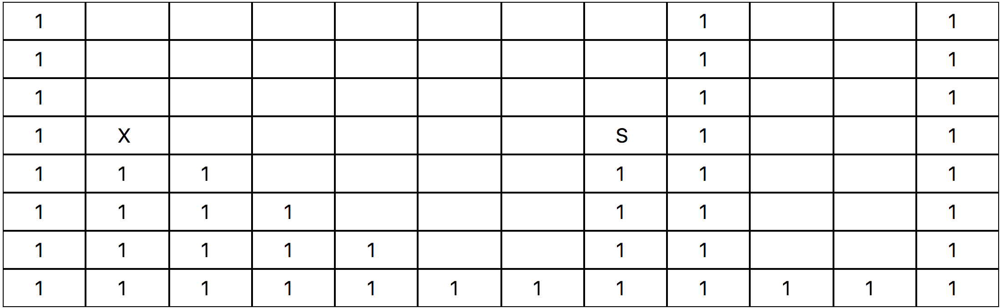

# Block Mate

## Einleitung

Der Auftraggeber möchte einen Prototyp für seine neue Spieleidee entwickeln, hat aber derzeit leider keine freien Resourcen und wendet sich daher an dich. Die neue Spielidee möchte er noch nicht mitteilen, hat im Internet aber folgendes Spiel entdeckt und festgestellt, dass dieses Spiel in etwa in die selbe Richtung wie seine Spielidee geht: http://azich.org/blockdude/

## Auftrag

Du sollst nun ein Frontend entwickeln, das eine Spielwelt in einer Art Raster darstellen kann. Die Spielwelt(en) wird/werden dir weiter unten in einem zweidimensionalen Array vorgegeben.

Im ersten Schritt sollst du nun diese Spielwelt in einem Frontend darstellen. Zunächst genügt es, wenn du die Blöcke in einem Raster farblich unterschiedlich darstellst. Der Spieler soll seine Spielfigur auch schon bewegen können, also mit den Pfeiltasten oder den Tasten W A S D.

Der Spieler muss das Feld `X` mit seiner Spielfigur erreichen.

Mit der Taste `R` kann der Spieler seine Spielfigur zum Start zurücksetzen. Zeige am besten ein Tutorial an, damit der Spieler weiß, wie er das Spiel zu spielen hat.

Die zu verwendenden Technologien werden dir vom Auftraggeber nicht vorgegeben.

## Spielregeln

- Der Spieler darf seine Spielfigur nur nach links und rechts bewegen
- Der Spieler darf mit seiner Spielfigur nur einen Block nach oben springen (du kannst dir selber aussuchen, ob die Spielfigur automatisch springt, oder ob der Spieler die Pfeiltaste nach oben drücken muss)
- Wenn der Spieler nach links oder rechts aus der Spielwelt herausgeht (sofern die Spielwelt dies erlaubt), befindet sich der Spieler auf der gegenüberliegenden Seite der Spielwelt
- Die Spielfigur kann herunterfallen (nicht beschränkt auf einen Block)

## Vorgaben

### Spielwelten

Die Spielwelten hat der Auftraggeber dir in der `worlds.json` vorgegeben. Die Spielwelten sollen in einem Dropdown auf der Seite auswählbar sein.

Erklärung der IDs in den Spielwelten:

| ID  | Erklärung                                                                                                                                                         |
| --- | ----------------------------------------------------------------------------------------------------------------------------------------------------------------- |
| 0   | Leerer Block, hier kann sich der Spieler frei bewegen                                                                                                             |
| 1   | Block, dieser wird als Wand oder Boden verwendet, durch diese kann der Spieler nicht durch laufen                                                                 |
| X   | Das Ziel, sobald der Spieler dieses Feld erreicht hat, hat er das Ziel erreicht. Zeige an, dass der Spieler die Welt wechseln kann, oder es erneut versuchen kann |
| S   | Dies ist die Startposition des Spielers                                                                                                                           |
| P   | Diese Blöcke können durch den Spieler aufgehoben und verschoben werden                                                                                            |

Erste Welt (FlatWorld):

Berge (mountains):

Block Mate fällt (falling):

Gerne kannst du die `worlds.json` um eigene Welten erweitern. Bitte kopiere dazu die `worlds.json` in deinen eigenen Ordner um Konflikte zu vermeiden. Nutze dafür den Welten-Generator `WorldGenerator.vue` den du per `vue serve WorldGenerator.vue` starten kannst.

### Optional

- Der Auftraggeber möchte in einer späteren Version auch Blöcke in der Spielwelt haben, die durch die Spielfigur getragen und abgelegt werden können. Falls du die Zeit dafür hast, schau dir die Spielwelt `PickBlocks` an
- Wenn du noch mehr Zeit hast, zeige keine Farben an, sondern richtige Grafiken für die Blöcke und die Spielfigur an

## Ausblick

Wenn der Prototyp gut ankommt, sind folgende Erweiterungen denkbar (vielleicht für zukünftige Code-Contest Aufgaben 😉):

- Zeige einen Timer an der startet, sobald der Spieler seine Spielfigur zum ersten mal bewegt hat und stoppt, sobald der Spieler das Ziel erreicht hat
- Ein Multiplayer-Modus:
  - Highscore Board, wer war am schnellsten
  - Live-Multiplayer: Über eine Socket-Verbindung gegen einen Mitspieler antreten und seinen Geist live anzeigen
- Ein Spielwelt-Generator, der eine schaffbare Spielwelt automatisch erzeugt
- Größere Spielwelten sollen so angezeigt werden, dass sich die Kamera mitbewegt und nur den aktuellen Bereich anzeigt
